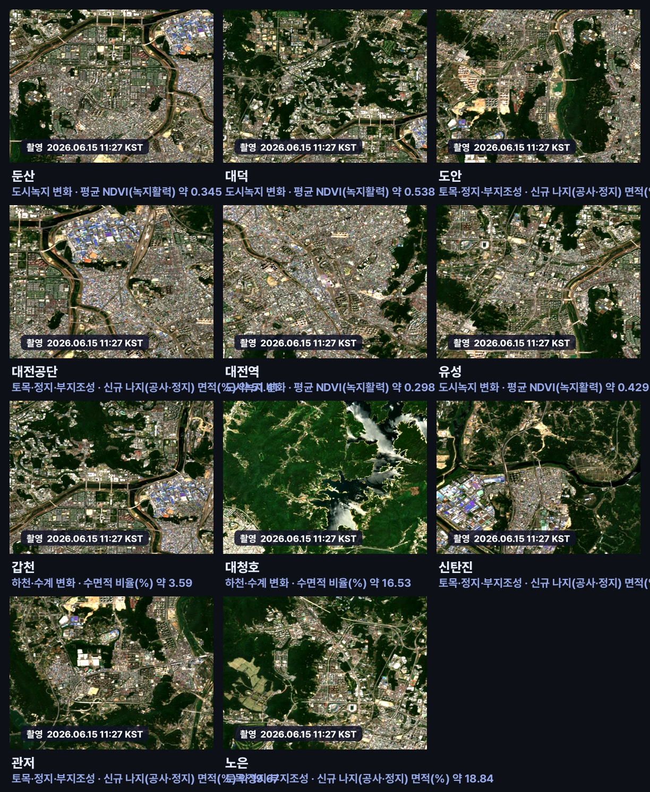
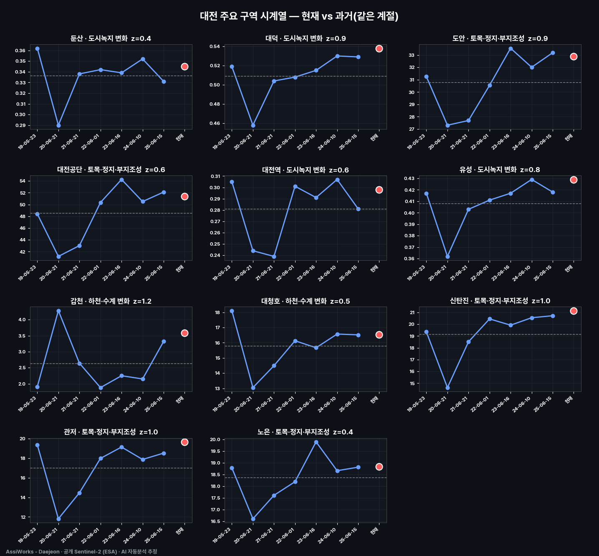

# 대전 도시 정기 모니터링 다이제스트 — 2026-06-20 23시

**발행**: 2026-06-20 23시 · **센서**: Sentinel-2 L2A (ESA) · 10 m · **공개 위성** · 관심구역 11곳
이번 회차는 임계를 넘는 **의미 있는 급변은 없었습니다.** 대신 주요 관심구역의 **최신 확대영상**과 **과거 같은 계절 대비 시계열**로 도시 상태를 정리합니다.

> ⚠️ **추정치·공개정보 안내**: 본 콘텐츠는 공개된 Sentinel-2(ESA Copernicus) 위성영상을 AI·알고리즘이 자동 분석한 **추정 결과**로, 사실과 다를 수 있습니다. 대상 좌표는 공개 지도 기반 근사 중심점이며 정밀 측지값이 아닙니다. 본 자료는 대전 도시 변화를 폭넓게 관찰하기 위한 참고용이며, 행정·법적 판단이나 특정 개인·사유지에 대한 감시 목적이 아닙니다. 정밀 측량·현장조사를 대체하지 않습니다.

---

## 관심구역 확대 영상 (최신 · 촬영시각 표기)
구역별 가장 최신 청천 Sentinel-2 트루컬러 확대 영상입니다. 각 영상 좌하단에 촬영 시각(KST)이 표기됩니다.

## 구역별 시계열 분석 (과거 같은 계절 대비)
각 구역의 대표 지표를 과거 같은 계절(연도별)과 비교한 추세입니다. 빨간 점이 현재(최신)입니다.

## 구역 상태 요약
| 구역 | 분야 | 대표 지표 | 최신값 | 과거평균 | z | 상태 |
|---|---|---|---|---|---|---|
| 둔산 | 도시녹지 변화 | 평균 NDVI(녹지활력) | 0.345 | 약 0.34 | 0.4 | 평년 수준 |
| 대덕 | 도시녹지 변화 | 평균 NDVI(녹지활력) | 0.538 | 약 0.51 | 0.9 | 평년 수준 |
| 도안 | 토목·정지·부지조성 | 신규 나지(공사·정지) 면적(%) | 32.88 | 약 30.79 | 0.9 | 평년 수준 |
| 대전공단 | 토목·정지·부지조성 | 신규 나지(공사·정지) 면적(%) | 51.41 | 약 48.55 | 0.6 | 평년 수준 |
| 대전역 | 도시녹지 변화 | 평균 NDVI(녹지활력) | 0.298 | 약 0.28 | 0.6 | 평년 수준 |
| 유성 | 도시녹지 변화 | 평균 NDVI(녹지활력) | 0.429 | 약 0.41 | 0.8 | 평년 수준 |
| 갑천 | 하천·수계 변화 | 수면적 비율(%) | 3.59 | 약 2.63 | 1.2 | 소폭 높음(+1.2σ) |
| 대청호 | 하천·수계 변화 | 수면적 비율(%) | 16.53 | 약 15.79 | 0.5 | 평년 수준 |
| 신탄진 | 토목·정지·부지조성 | 신규 나지(공사·정지) 면적(%) | 21.15 | 약 19.16 | 1.0 | 소폭 높음(+1.0σ) |
| 관저 | 토목·정지·부지조성 | 신규 나지(공사·정지) 면적(%) | 19.67 | 약 17.02 | 1.0 | 소폭 높음(+1.0σ) |
| 노은 | 토목·정지·부지조성 | 신규 나지(공사·정지) 면적(%) | 18.84 | 약 18.36 | 0.4 | 평년 수준 |

- 상태는 '그 구역 자신의 과거 같은 계절 대비' z 기준입니다(|z|<1 평년). 모든 수치는 AI 자동분석 추정으로 사실과 다를 수 있습니다.
---
_AssiWorks - Daejeon · 2026-06-20 23시 · 정기 모니터링 다이제스트 · 공개 Sentinel-2 (ESA)_
