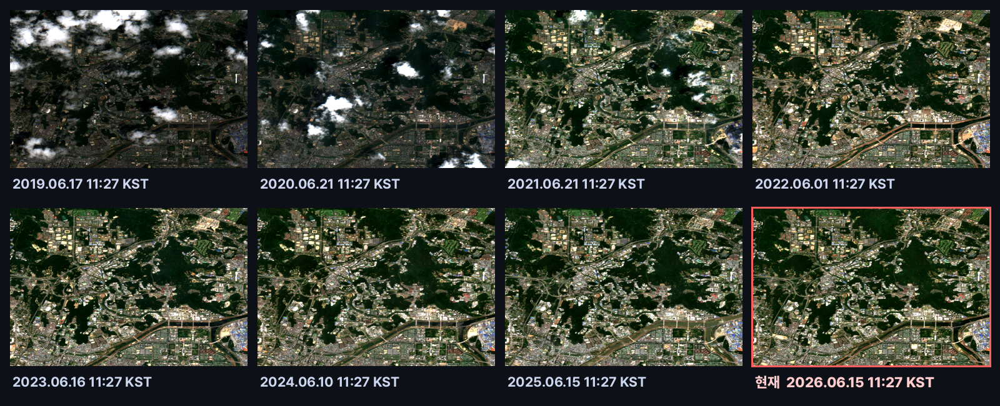
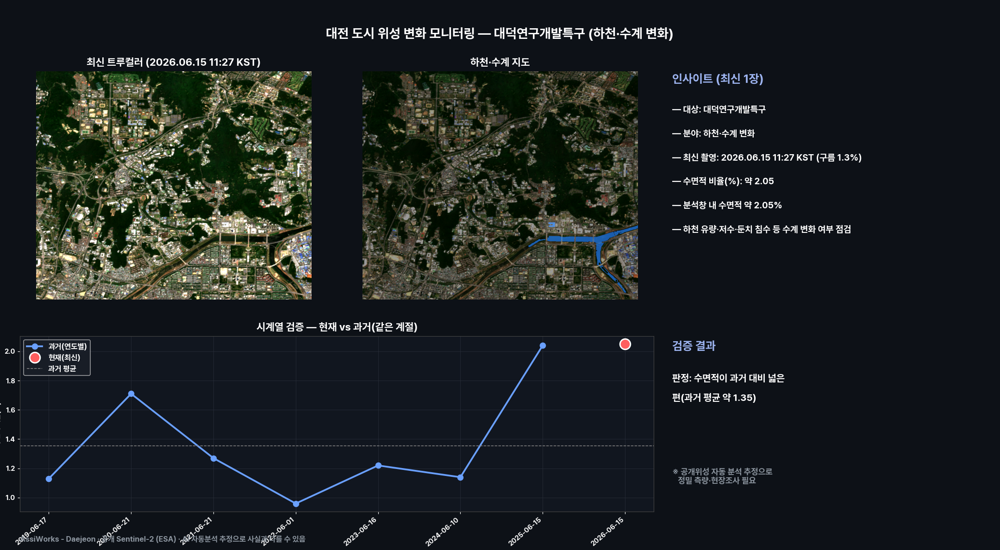
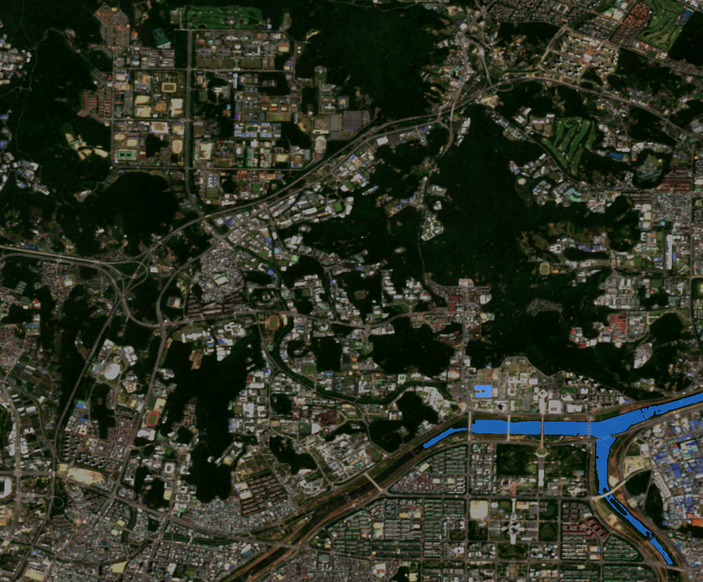
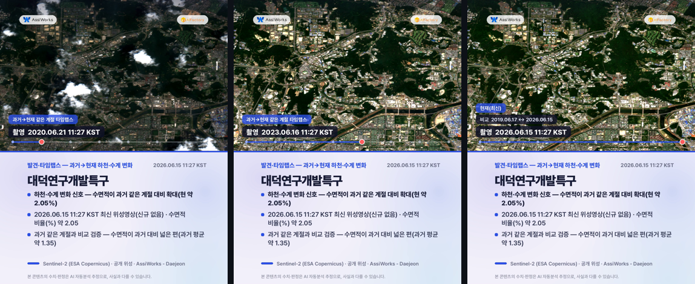
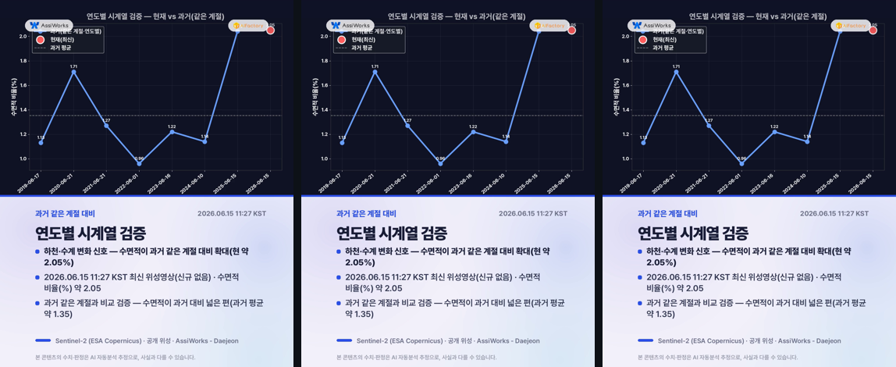
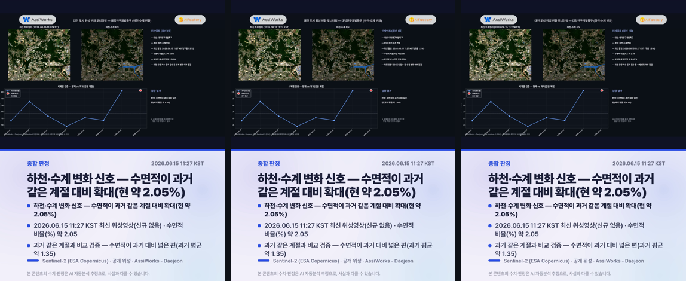

# 대전 도시 위성 변화 모니터링 — 대덕연구개발특구 (하천·수계 변화)

**발행**: 2026-06-23 09시 · **분야**: 하천·수계 변화 · **센서**: Sentinel-2 L2A (ESA) · 10 m · **공개 위성**
**대상 구역**: 대덕연구개발특구(Daedeok Innopolis) · 정부출연연·과학기술 연구단지
**원본 촬영**: 2026.06.15 11:27 KST (구름 1.3%, 최신 위성영상(신규 장면 없어 최신 영상 사용)) · **분석창**: 중심 ±3.6km

> ⚠️ **추정치·공개정보 안내**: 본 콘텐츠는 공개된 Sentinel-2(ESA Copernicus) 위성영상을 AI·알고리즘이 자동 분석한 **추정 결과**로, 사실과 다를 수 있습니다. 대상 좌표는 공개 지도 기반 근사 중심점이며 정밀 측지값이 아닙니다. 본 자료는 대전 도시 변화를 폭넓게 관찰하기 위한 참고용이며, 행정·법적 판단이나 특정 개인·사유지에 대한 감시 목적이 아닙니다. 정밀 측량·현장조사를 대체하지 않습니다.

---

## 핵심 발견
> **하천·수계 변화 신호 — 수면적이 과거 같은 계절 대비 확대(현 약 2.05%)**

## 1단계 — 발견 (최신 1장)
- 2026.06.15 11:27 KST 촬영 영상이 대덕연구개발특구 구역에 걸쳐, 분석창 안에서 하천·수계 변화(수면적 비율(%))을(를) 분석했습니다.
- 수면적 비율(%): 약 2.05.
- 분석창 내 수면적 약 2.05%
- 하천 유량·저수·둔치 침수 등 수계 변화 여부 점검

## 2단계 — 시계열 검증 (같은 계절·연도별)
같은 구역의 과거 같은 계절 청천 영상(7개)과 비교해 검증합니다.
- 과거: 06-17 1.13, 06-21 1.71, 06-21 1.27, 06-01 0.96, 06-16 1.22, 06-10 1.14, 06-15 2.04
- 현재: 06-15 약 2.05
- **판정: 수면적이 과거 대비 넓은 편(과거 평균 약 1.35)**
- ※ 공개위성 자동 분석 추정으로 정밀 측량·현장조사가 필요합니다.

## 과거→현재 같은 계절 영상 (연도별 · 촬영시각 표기)
리포트에서 바로 과거 영상을 확인할 수 있습니다. 각 영상에 촬영 시각(KST)이 표기되며, 빨간 테두리가 현재(최신) 영상입니다.

## 분석 종합 (발견 + 검증)

## 하천·수계 지도

## 영상카드 (미리보기)

_아래는 각 영상의 대표 장면입니다. 영상은 링크에서 재생/다운로드._

▶️ [card1_discovery.mp4 영상 보기](videocards/card1_discovery.mp4)

▶️ [card2_timeseries.mp4 영상 보기](videocards/card2_timeseries.mp4)

▶️ [card3_summary.mp4 영상 보기](videocards/card3_summary.mp4)

---
_AssiWorks - Daejeon · 2026-06-23 09시 · 공개 Sentinel-2 (ESA)_
