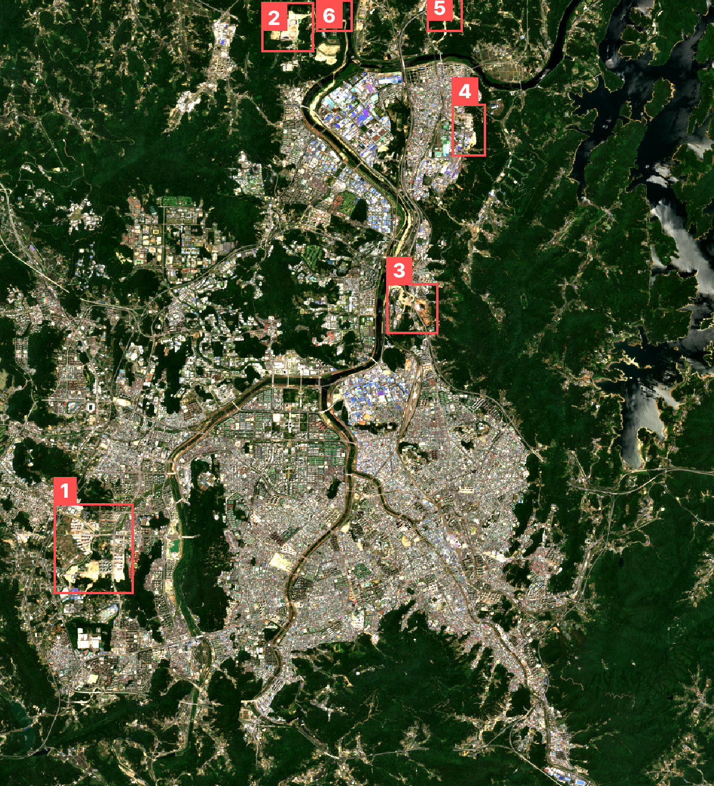
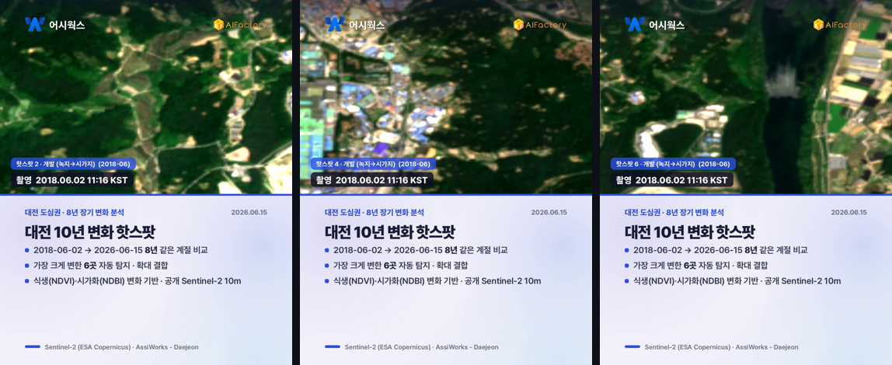

# 대전 10년 변화 핫스팟 분석 — 2026-06-15 vs 2018-06-02 (8년)

**발행**: 2026-06-23 10시 · **분야**: 장기 변화(핫스팟) · **센서**: Sentinel-2 L2A (ESA) · 10 m · **공개 위성**
**비교**: 최근 2026.06.15 11:27 KST(구름 1.3%) ↔ 과거 2018.06.02 11:16 KST(구름 1.9%) · **분석창**: 대전 도심권 광역

> ⚠️ **추정치·공개정보 안내**: 본 콘텐츠는 공개된 Sentinel-2(ESA Copernicus) 위성영상을 AI·알고리즘이 자동 분석한 **추정 결과**로, 사실과 다를 수 있습니다. 대상 좌표는 공개 지도 기반 근사 중심점이며 정밀 측지값이 아닙니다. 본 자료는 대전 도시 변화를 폭넓게 관찰하기 위한 참고용이며, 행정·법적 판단이나 특정 개인·사유지에 대한 감시 목적이 아닙니다. 정밀 측량·현장조사를 대체하지 않습니다.

---

## 핵심 — 8년간 가장 크게 변한 곳
> 같은 계절 두 시점(2018-06-02 → 2026-06-15)을 비교해, 식생·시가화가 가장 두드러지게 변한 **6곳**을 자동 탐지했습니다.

## 8년 변화 지도 (핫스팟 위치)
번호가 변화가 큰 순서이며, 빨간 박스가 핫스팟입니다.

## 핫스팟 확대 — 과거→현재 결합 영상카드
각 핫스팟을 확대해 **2018-06 → 2026-06** 변화를 하나의 영상으로 이어 보여줍니다. 각 장면 좌하단에 촬영시각(KST), 우측에 비교 구간이 표기됩니다.

## 영상카드 (미리보기)

_아래는 각 영상의 대표 장면입니다. 영상은 링크에서 재생/다운로드._

▶️ [card_decadal.mp4 영상 보기](videocards/card_decadal.mp4)

## 핫스팟 요약
| # | 위치(추정) | 변화 유형 | ΔNDVI | ΔNDBI | 변화강도 |
|---|---|---|---|---|---|
| 1 | 36.33045, 127.32748 | 개발 (녹지→시가지) | -0.280 | +0.218 | 0.57 |
| 2 | 36.46318, 127.38452 | 개발 (녹지→시가지) | -0.528 | +0.400 | 0.861 |
| 3 | 36.39167, 127.4211 | 개발 (녹지→시가지) | -0.340 | +0.215 | 0.536 |
| 4 | 36.43697, 127.43772 | 개발 (녹지→시가지) | -0.427 | +0.283 | 0.647 |
| 5 | 36.46712, 127.43072 | 개발 (녹지→시가지) | -0.429 | +0.331 | 0.708 |
| 6 | 36.46606, 127.39818 | 개발 (녹지→시가지) | -0.480 | +0.345 | 0.767 |

- ΔNDVI 음수=식생 감소(개발 가능), ΔNDBI 양수=시가화 증가. 위치는 분석창 픽셀 기반 추정 좌표입니다.
- 모든 수치·판정은 공개위성 AI 자동분석 추정으로, 정밀 측량·현장조사를 대체하지 않습니다.
---
_AssiWorks - Daejeon · 2026-06-23 10시 · 10년 변화 핫스팟 분석 · 공개 Sentinel-2 (ESA)_
